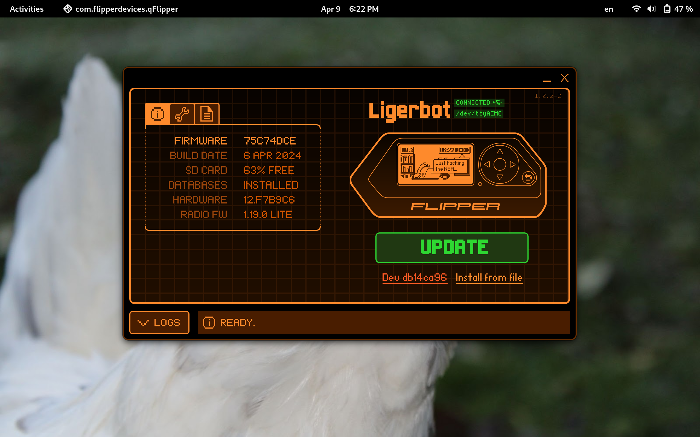
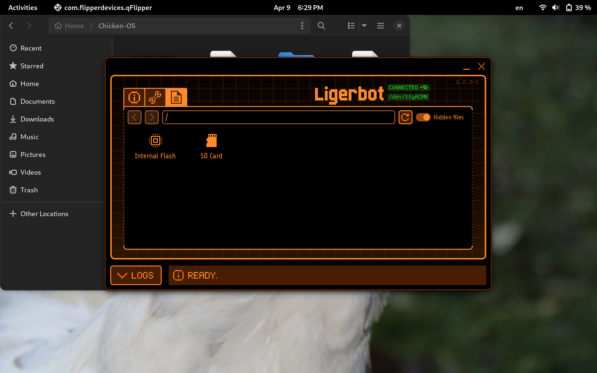

# Chicken OS

## Chicken-Themed Asset Pack for Flipper Zero

Welcome to Chicken OS, a custom asset pack designed to enhance your Flipper Zero experience with a chicken theme! Get a fresh look and feel with our unique set of visuals.

## Important Links

* [Flipper Zero Official Firmware](https://flipperzero.one/update)
* [How to Make an Asset Pack for Flipper Zero](https://www.youtube.com/watch?v=J8gfCZi2vyc)

## Making Your Own Asset Pack

Here are general guidelines to create asset packs for Flipper Zero:

1. **Gather your assets:** Create or obtain chicken-themed animations, icons, and any additional files you want to include.
2. **Understand file structure:** Research the required folder structure and naming conventions for asset packs. This might vary depending on the firmware.
3. **Follow firmware guidelines:** Refer to documentation for your specific firmware for specific instructions and requirements.
4. **Test thoroughly:** Once you've created your asset pack, test it on your Flipper Zero to ensure compatibility and functionality.
5. **Share and contribute:** Consider sharing your asset pack with the community or contributing to open-source projects!

## Changelog

*List your asset pack's updates and changes here, organized by version.*

**Changelog coming soon!**

## Installation and Usage

*Provide clear instructions on how to install and use your asset pack.*

**1**Open the QFlipper application.
**2**Open the file explorer
**3**Navigate to the /asset_packs/ directory.
**4**Then, download this project as a zip file, unzip it, and drag and
drop it into the folder.
**5**On the flipper, go to the Momentum/Xtreme app and then go to Interface,
then click on Graphics. Then press the right arrow until you see Chicken_OS

## Contribute

If you're a developer or designer, feel free to contribute to Chicken OS! Share your ideas or code changes to make the most coop-erative asset pack ever.

## Contact

For any questions, feedback, or support, please reach out to me at :

**lawrence.shadowcroft@proton.me**
